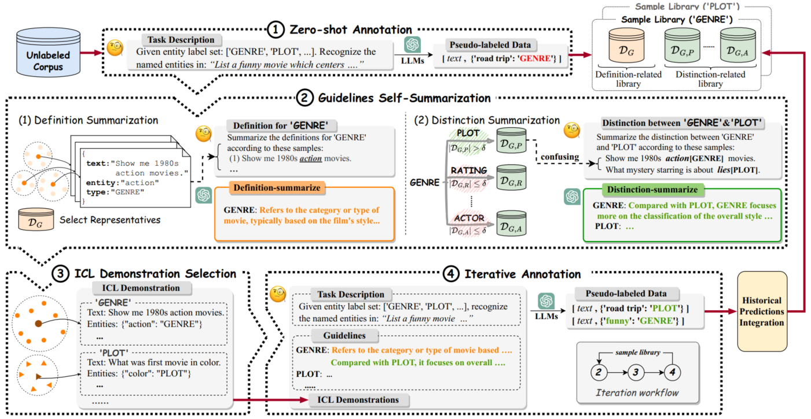

## EvoPrompt

Code for COLING 2025 paper "EvoPrompt: Evolving Prompts for Enhanced Zero-Shot Named Entity Recognition with Large Language Models"


## Model architecture




## Requirements

Refer to `requirements.txt` for the main requirements.


## Preparation

* There are two key parameters that require attention:
  * `args.dataset`：The name of the dataset to be used
  * `args.model_name`：The name of the model（*e.g. Llama-3.1-70B-Instruct-GPTQ or gpt-3.5-turbo*）

* Config your data format as shown in the example directory: `dataset/demo/`

* To simplify execution, we recommend setting up the file paths as described below, or alternatively, modifying the relevant code configuration:

  * Sentence embedding model path: `embedding_model/Labse`（Note: we use the `Labse` model as the embedding model）

  * Local LLMs path (if you run with the local download model): `model/{args.model_name}`

  * Data path: `dataset/{args.dataset}/test.json` and `dataset/{args.dataset}/labels.txt`

  * Make sure to create the following directory structure for saving the results: `predictions/{args.model_name}/{args.dataset}/`

    * Before running, ensure the initial prompt is set up in the following file: `predictions/{args.model_name}/{args.dataset}/prompts_{args.dataset}.json`. The content of the prompt should be as follows:

      ```json
      {
          "step0": "Prompt for this initial step"
      }
      ```

  **※ We have marked the above content in the code (marked with 🔺 or ⭐). You can adjust these according to your specific requirements to enhance the code's convenience and robustness.**


## Run

* To run with the local models

  ```shell
  python offline.py \\
  --dataset {dataset_name} \\
  --iterations {iteration_nums} \\
  --shots_per_type {num of icl demonstrations per type} \\
  --model_name {llm_name}
  ```

* To run with the api model

  * config your aip-keys in the `api.py` and run it the same as above


## Citation

If you find this repository useful, please cite our paper. Thanks for your support